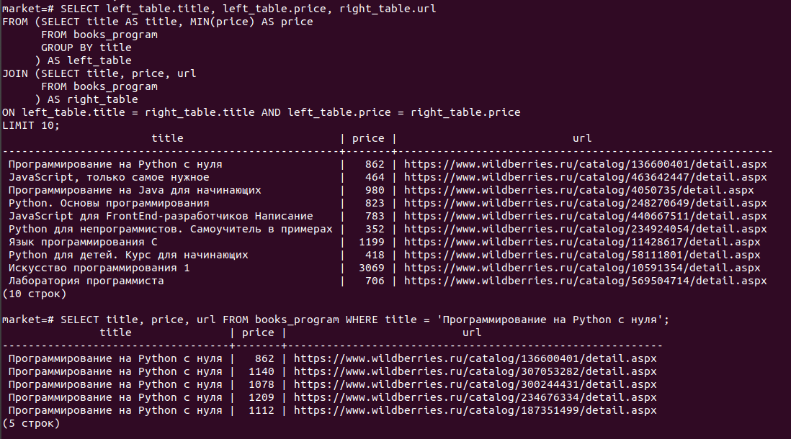
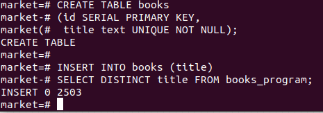
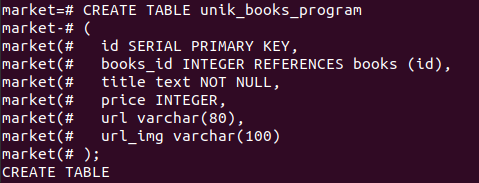
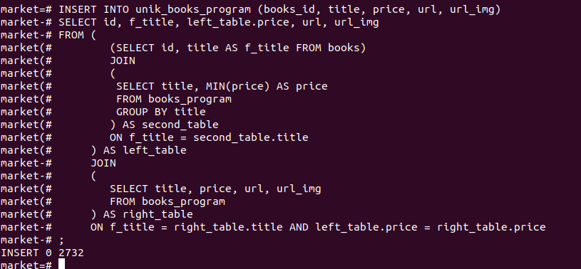

Этот проект создан для демонстрации моих знаний в docker, SQL, взаимодействии между питоновской библиотекой SQLAlchemy и базой данных в PostgreSQL.

Запущу сервер PostgreSQL в docker-контейнере. В нём создам базу данных market и таблицу books-program. В таблицу запишу данные от парсинга магазина wildberries.ru, что он выдаёт по поиску "книги программирование", используя библиотеку SQLAlchemy. Сделаю несколько запросов к бд на языке SQL (диалект postgresql).
## Docker ##
Как уже написал буду запускать сервер PostgreSQL в docker-контейнере.
Для начала отключу сервер PostgreSQL на хосте, он автоматически у меня запускается как служба в Ubuntu 20.04:
```
sudo service postgresql stop
```
После этого создам имитацию удалённого сервера PostgreSQL:
```
docker run --rm -e POSTGRES_PASSWORD=passw -e POSTGRES_USER=dmitriy 
-e POSTGRES_DB=postgres -d -p 5432:5432 -v $HOME/docker/volumes/postgres:/var/lib/postgresql/data postgres
```
Образы можно создавать с помощью файла Dockerfile, но поскольку мне в контейнере нужен только PostgreSQL, то проще всего взять "голый" образ с Docker хаба и с нужными опциями запустить контейнер сразу. Опция POSTGRES_PASSWORD является обязательной, POSTGRES_DB необязательная, но поскольку бд dmitriy не существует, то указал postgres, автоматически создаваемую во всех PostgreSQL.

Опция -v служит для проброса каталога с хоста на каталог файловой системы контейнера. Указал, чтобы созданная и заполненная потом на 6000 строк бд не пропала после удаления контейнера. Контейнер удаляется автоматически из-за опции - rm.

Сервер PostgreSQL создался в контейнере, это как бы отдельный компьютер, имеющий свой собственный IP-адрес (псевдоним localhost). Для связи с этим сервером служат клиентские программы типа pgAdmin или DBeawer, но я предпочитаю пользоваться утилитой psql.
```
psql -h localhost -U dmitriy -d demo
```
demo - конкретно существующая бд в моём запущенном сервере. Неважно какая бд, лишь бы существовала. Всегда существует postgres.
Связь с сервером установили.
Теперь с помощью запросов SQL можно работать с PostgreSQL. Также в psql есть метакоманды. Список некоторых метакоманд:
- \l - список существующих баз данных.
- \dt - список таблиц в базе данных, с которой установили соединение.
- \c - команда для перехода в другую базу данных.

Создам базу данных market. Вообще я не хотел её через SQL создавать, хотел вначале через питоновский скрипт создать. Но на практике, когда я запускал сервер с монтировкой каталогов и с -e POSTGRES_DB=market и потом запускал скрипт.py, то получал исключение, что market не существует. Поэтому:
```
CREATE DATABASE market;
```
## Python ##
Перейдем теперь к созданию скрипта на языке Python. С помощью этого скрипта буду делать так называемый парсинг сайта wildberries.py . С сайта нужно "забрать" все книги, выдаваемые через поиск по словам "книги программирование". Этот скрипт назвал wb.py .

Пытался забрать информацию с стартовой страницы используя библиотеку bs4, не смог. Пришлось использовать Selenium, используемую для запуска браузера.
#### Функции wb.py #
Функция settings_browser() устанавливает настройки браузера через класс ChromeOptions(). Без этих настроек не удастся одолеть защиту сайта от ботов.

Функция open_page() открывает страницу сайта. У меня включена options.add_argument("--headless"), поэтому браузер работает в фоновом режиме, за его работой наблюдаю в терминале. После того как полностью страница полностью прокрутится, все элементы-книги загрузятся, в список записываем словари, где ключи словаря:
- title - название книги
- url - url страницы книги
- price - цена книги
- img_url - url страницы с картинкой обложки книги

 Сформировали список для страницы, смотрим есть ли еще страница. Если есть переходим на неё с помощью этой же функции (рекурсия). Этой функции передаём список данных, полученных с предыдущих страниц. И когда переходим на последнюю страницу и обработаем её, то получим в итоге список из данных от всех пройденных страниц. Этот конечный список возвращаем через return. На практике до получения вебэлемента, означающего, что поиск выдал всю информацию, я обработал ровно 60 страниц, каждая страница - это 100 элементов-книг. Таким образом получил список из 6000 словарей.

С помощью функции write_to_xlsx() записываем данные с списка в файл books_wb.xlsx . Функция является асинхронной, точнее асинхронно работает внутренняя функция write_webp(), которая почти параллельно посылает 6000 запросов на чтение картинок с их url. Конечно такое количество запросов получает много исключений типа time_out_connection. Ну и главное, когда я открыл books_wb.xlsx, то не смог до конца прокрутить электронную таблицу. Поэтому идею с записью такого количества данных в файл для **моего компьютера** признал "извращённой" и закомментировал строку asyncio.run(write_to_xlsx(lst_data)) в функции main().

Далее в main() импортирую мой модуль database и выполняю из этого модуля функцию write_db() . По названию функции понятно, что она записывает данные из списка в базу данных сервера PostgreSQL. Для этого используется кросс-диалектная библиотека SQLAlchemy.
Внутри write_db() также, чтобы данные в таблице books_program не дублировались каждый раз с запуском wb.py, реализовал предварительное очищение таблицы.
 В результате работы скрипта wb.py в базе данных market появится таблица books_program.
## SQL ##
Теперь можно вернуться к разделу, посвященному Docker. После того, как создали сервер PostgreSQL через утилиту psql сразу устанавливаю соединение с market:
```
psql -h localhost -U dmitriy -d market
```
Смотрю количество строк в books_program:
```
SELECT count(id) FROM books_program;
```


А также уникальных по названию книги.
Как видно, в таблице очень много дублей, по названию книги  уникальных значений 2503 из 6000 строк. Мне это не нравится и попробую создать новую таблицу на базе books_program из уникальных title, но с минимальной ценой из группы повторяющихся title и соответствующие этой цене url'ы книги. Как же это сделать?
```
SELECT left_table.title, left_table.price, right_table.url
FROM (SELECT title AS title, MIN(price) AS price
      FROM books_program
      GROUP BY title
     ) AS left_table
JOIN
     (SELECT title, price, url
      FROM books_program
     ) AS right_table
ON left_table.title = right_table.title AND left_table.price = right_table.price
LIMIT 20;
```


Создадим на основе этого запроса новую таблицу unik_books_program по структуре повторяющую  books_program.
Но предварительно создадим таблицу-справочник книг books, которая будет содержать только 2 столбца: id - идентификатор книги и title - название книги. Смысл этой таблицы - являться справочником по названиям книг.
```
CREATE TABLE books
(id SERIAL PRIMARY KEY, 
 title text UNIQUE NOT NULL);
```
Вставим в эту таблицу уникумы по title из books_program.
```
INSERT INTO books (title)
SELECT DISTINCT title FROM books_program;
```


Теперь займёмся таблицей unik_books_program.
```
CREATE TABLE unik_books_program
(
  id SERIAL PRIMARY KEY,
  books_id INTEGER REFERENCES books (id),
  title text NOT NULL,
  price INTEGER,
  url varchar(80),
  url_img varchar(100)
);
```

Поле books_id является внешним ключом и связана с родительским ключом id таблицы books.
Вставка значений из books_program на основе первоначального запроса будет неправильной, поскольку теперь нужно учитывать books_id, указывающий на id из books.
```
INSERT INTO unik_books_program (books_id, title, price, url, url_img)
SELECT id, f_title, left_table.price, url, url_img
FROM (
        (SELECT id, title AS f_title FROM books)
        JOIN
        (
         SELECT title, MIN(price) AS price
         FROM books_program
         GROUP BY title
        ) AS second_table
        ON f_title = second_table.title
     ) AS left_table
     JOIN
     (
        SELECT title, price, url, url_img
        FROM books_program
     ) AS right_table
     ON f_title = right_table.title AND left_table.price = right_table.price
;
```

